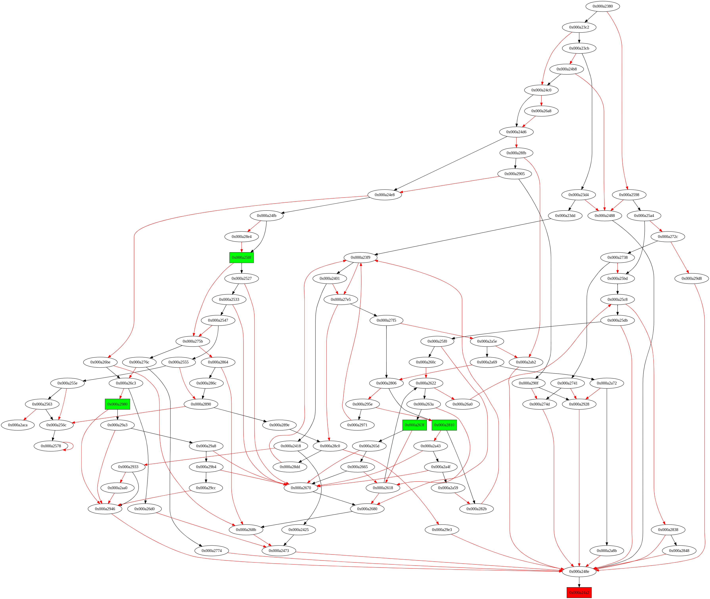
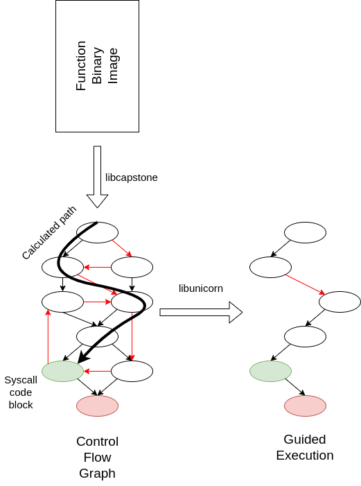

# The idea at glance

The process starts with the function binary image provided by the user, 
which is a representation of the compiled machine code for a given function.
This binary image is fed into the `libcapstone` disassembler, which
translates the machine code into assembly instructions list.

Once the disassembled version of the binary image is obtained, an elaboration
process takes place to generate the control flow graph (cfg) for the given
function. The cfg is a graphical representation of all the possible paths
that can be taken during the execution of the function. Each node in the
graph represents an instruction block, and edges represent the possible
transitions between instruction blocks.

This image has been produced as intermediate step, and relates to the
glibc function `__pthread_mutex_lock_full`.

In this resulting cfg image, the green bubble represents an instruction block
that contains a `syscall`, while the red bubble represents an instruction
block that contains a `ret` instruction.

The next step involves finding a path from the entry point of the function
to the `syscall` instruction block.

Once the path is identified, an additional operation is performed where the
code is scanned to identify any `call` instructions along the path. 
Any `call` instructions needs to be replaced with `nop` instructions to 
ensure that the guided execution only follows the path that leads to the
`syscall` instruction block and does not deviate due to calls to other
functions (whose binary image is not present).

After the `call` instructions are replaced with `nop` instructions, a 
guided execution is performed using the `libunicorn`.
During guided execution, each instruction block along the path is executed
and the context (CPU state) of any block is used to start the execution of
next.

The execution hits the `syscall` instruction, the register
values are read to determine the syscall number. 

